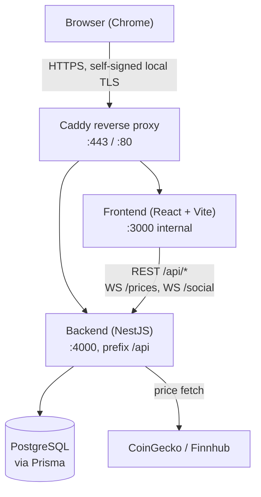

# PaperTrade — System Architecture

> This document describes the **as-built** system (verified against the code on `main`), not the original pre-development plan. Where the real implementation diverged from the initial design, that's called out explicitly at the bottom instead of silently rewriting history.

## High-Level Overview



All three services (frontend, backend, db) plus the Caddy proxy run under one `docker compose up`. The browser only ever talks to Caddy over HTTPS — it never hits the frontend dev server or the backend directly, and the backend never calls out to the frontend.

## Backend Structure (NestJS) — `project/backend/src`

```
src/
├── main.ts                     # global prefix "api", ValidationPipe, cookie-parser,
│                                #   CORS locked to FRONTEND_URL, static /uploads
├── app.module.ts
├── app.controller.ts            # GET /, GET /health
├── app.service.ts
│
├── auth/                        # login, register, JWT, OAuth, AND 2FA — all in one module
│   ├── auth.controller.ts
│   ├── auth.service.ts
│   ├── auth.module.ts
│   ├── jwt.strategy.ts / jwt-auth.guard.ts / jwt-payload.interface.ts
│   ├── oauth-auth.guard.ts
│   ├── oauth-config.ts          # isGoogleOAuthConfigured() / isGithubOAuthConfigured() /
│   │                             #   isFortyTwoOAuthConfigured() — env-based feature flags
│   ├── strategies/
│   │   ├── google.strategy.ts
│   │   ├── github.strategy.ts
│   │   └── fortytwo.strategy.ts
│   └── dto/auth.dto.ts          # RegisterDto, LoginDto, TwoFactorCodeDto,
│                                 #   LoginTwoFactorDto, ChangePasswordDto
│
├── users/
│   ├── users.controller.ts / users.service.ts / users.module.ts
│   ├── avatar-upload.config.ts  # multer config for avatar uploads
│   └── dto/ (update-profile, search-users, deposit)
│
├── assets/                      # tradeable assets AND market data — no separate "market-data" module
│   ├── assets.controller.ts / assets.service.ts / assets.module.ts
│   ├── market-data.service.ts   # CoinGecko + Finnhub fetch logic lives here
│   └── dto/assets-query.dto.ts
│
├── orders/                      # the only HTTP surface for placing/cancelling orders
│   ├── orders.controller.ts / orders.service.ts / orders.module.ts
│   └── dto/ (create-order, get-orders.query)
│
├── trading/                     # order execution engine — service only, no controller
│   ├── trading.service.ts
│   ├── trading.module.ts
│   └── price-checker.scheduler.ts   # @Interval(30s): fills PENDING limit orders
│                                     #   whose target price was crossed
│
├── portfolio/
│   └── portfolio.controller.ts / portfolio.service.ts / portfolio.module.ts
│
├── analytics/
│   ├── analytics.controller.ts / analytics.service.ts / analytics.module.ts
│   ├── pdf-report.ts             # PDF export helper
│   ├── snapshot.scheduler.ts     # daily portfolio snapshot cron
│   └── dto/analytics.dto.ts      # date-range filter, from ≤ to validated
│
├── social/                       # umbrella module: friends + chat + notifications + leaderboard
│   ├── social.module.ts
│   ├── social.gateway.ts         # the ONE WebSocket gateway for social features (namespace /social)
│   ├── friends/
│   │   └── friends.controller.ts / friends.service.ts
│   ├── messages/
│   │   └── messages.controller.ts / messages.service.ts
│   ├── notifications/            # sub-feature of social, not its own top-level module
│   │   ├── notifications.controller.ts / notifications.service.ts
│   │   └── order-notifications.listener.ts   # EventEmitter bridge: orders → notifications
│   └── leaderboard/
│       └── leaderboard.controller.ts / leaderboard.service.ts
│
├── websocket/                    # contains ONLY the price feed gateway — NOT a catch-all for every gateway
│   ├── websocket.module.ts
│   └── price-feed.gateway.ts     # namespace /prices
│
├── gdpr/
│   ├── gdpr.controller.ts / gdpr.service.ts / gdpr.module.ts
│   └── dto/delete-account.dto.ts
│
├── common/                       # cross-cutting concerns used by several modules
│   ├── mail/                     # mail.module.ts / mail.service.ts — used only by GdprModule
│   ├── crypto/secret-cipher.ts   # AES-256-GCM encrypt/decrypt of the 2FA TOTP secret at rest
│   ├── ws/ws-auth.util.ts        # shared JWT-from-cookie handshake auth for BOTH gateways
│   ├── decorators/ (current-user, public)
│   └── constants.ts / parse-query-int.ts
│
└── prisma/
    ├── prisma.module.ts
    └── prisma.service.ts
```

**Module boundaries that don't match a "typical" layout, on purpose:**
- **2FA is not its own module** — it's a handful of endpoints and DTOs inside `auth/`, plus one shared crypto helper. Splitting it out would have meant a circular dependency back into `auth` for no benefit.
- **Notifications lives inside `social/`**, not at the top level — every notification-worthy event in this app (friend request, message, order fill) originates from a social interaction or is delivered through the same `/social` WebSocket, so it made sense to keep it co-located rather than have `social` depend on a sibling module for its own push mechanism.
- **`assets/` owns market data**, not `trading/`. Trading only executes orders against whatever price `assets/market-data.service.ts` last wrote to the database — it has no idea CoinGecko or Finnhub exist.
- **Two separate WebSocket gateways in two separate folders** (`websocket/price-feed.gateway.ts` and `social/social.gateway.ts`), each with a different namespace (`/prices`, `/social`) and a different purpose, but both authenticating the handshake through the same shared `common/ws/ws-auth.util.ts` helper — so there's exactly one place that decides "is this socket's JWT cookie valid," even though there are two gateways.

## Frontend Structure (React) — `project/frontend/src`

```
src/
├── main.tsx / App.tsx / App.css / index.css
│
├── api/
│   ├── api.ts                # shared axios instance
│   └── avatar.ts
│
├── auth/
│   ├── authContext.tsx / authProvider.tsx / useAuth.tsx
│
├── social/
│   └── SocialContext.tsx     # friends/presence/chat state, backed by the /social WS
│
├── prices/
│   ├── PriceFeedContext.tsx  # holds the live price map from the /prices WS
│   └── useLivePrice.ts
│
├── toast/
│   └── ToastContext.tsx
│
├── routes/
│   ├── ProtectedRoute.tsx
│   └── PublicRoute.tsx
│
├── pages/                    # one file per route — Dashboard, Trading, Markets, AssetDetails,
│                              #   Portfolio, Analytics, Friends, Messages, Leaderboard, Search,
│                              #   Settings, Login, Register, PublicProfile, Privacy, Terms,
│                              #   Index, NotFound
│
├── components/                # Navbar, Sidebar, Footer, PageShell, PublicLayout,
│                              #   AssetsTable, PriceChart, HoldingsTable, PortfolioHoldingsTable,
│                              #   OrdersPanel, OpenOrdersTable, OrderHistoryTable,
│                              #   FriendCard, MessageBubble, NotificationBell,
│                              #   LeaderboardRow, LanguageSwitcher, Avatar
│
├── services/
│   ├── trading.service.ts / social.service.ts / user.service.ts
│
├── i18n/
│   ├── index.ts
│   └── locales/ (en.json, fr.json, nl.json)
│
├── types/ (types.ts, social.ts)
├── utils/format.ts            # locale-aware currency/number formatting
└── hooks/useDebounce.ts
```

**State management is plain React Context + hooks throughout** (`authContext`, `SocialContext`, `PriceFeedContext`, `ToastContext`) — there is no Redux and no custom store layer. `zustand` is present in `package.json` from early planning but was never actually used anywhere in the source; Context proved sufficient for this app's scale.

## Key API Endpoints

All routes below are additionally prefixed with `/api` (set once via `app.setGlobalPrefix('api')` in `main.ts`) — e.g. `auth/login` below is really `POST /api/auth/login`. Unless noted "Public", a route requires a valid `access_token` cookie (`JwtAuthGuard`).

### Auth (`auth/`)
| Method | Path | Notes |
|---|---|---|
| GET | `auth/providers` | Public — which OAuth buttons the frontend should render |
| POST | `auth/register` | Public |
| POST | `auth/login` | Public — may return `{ requires2FA, loginToken }` instead of tokens |
| POST | `auth/login/2fa` | Public — completes login with `loginToken` + 6-digit code |
| POST | `auth/refresh` | Public — reads the `refresh_token` cookie |
| POST | `auth/2fa/setup` | Generates TOTP secret + QR |
| POST | `auth/2fa/verify` | Verifies code, enables 2FA |
| POST | `auth/2fa/disable` | Requires a valid code |
| POST | `auth/change-password` | Current session, current + new password |
| POST | `auth/logout` | Clears cookies, revokes the refresh token server-side |
| GET | `auth/google`, `auth/google/callback` | Only registered if Google env vars are set |
| GET | `auth/github`, `auth/github/callback` | Only registered if GitHub env vars are set |
| GET | `auth/42`, `auth/42/callback` | Only registered if 42 env vars are set |

### Users (`users/`)
| Method | Path | Notes |
|---|---|---|
| GET | `users/me` | Own profile |
| PUT | `users/me` | Update profile |
| PUT | `users/me/avatar` | Multipart upload |
| GET | `users/search` | `q`, `page`, `limit` (max 50) |
| POST | `users/deposit` | Add virtual balance |
| GET | `users/:id` | Another user's public profile |

### Assets (`assets/`) — all Public
| Method | Path | Notes |
|---|---|---|
| GET | `assets` | `q`, `type`, `sort`, `order`, `page`, `limit` |
| GET | `assets/:symbol/history` | `days` (default 30) — declared before `:symbol` so it isn't shadowed |
| GET | `assets/:symbol` | Single asset |

### Orders (`orders/`)
| Method | Path | Notes |
|---|---|---|
| GET | `orders` | Filters: `status`, `type`, `assetId` |
| POST | `orders` | Market or limit, buy or sell |
| DELETE | `orders/:id` | Cancel a pending order |

### Portfolio & Analytics
| Method | Path | Notes |
|---|---|---|
| GET | `portfolio` | Holdings + live computed value |
| GET | `analytics/portfolio` | History, `from`/`to` |
| GET | `analytics/allocation` | Current asset breakdown |
| GET | `analytics/stats`, `analytics/trades` | `from`/`to` |
| GET | `analytics/export/csv`, `analytics/export/pdf` | `from`/`to` |

### Social — Friends / Messages / Notifications / Leaderboard
| Method | Path | Notes |
|---|---|---|
| POST | `friends/request/:userId` | Notifies the addressee |
| GET | `friends`, `friends/requests`, `friends/requests/outgoing` | |
| PUT | `friends/:id/accept`, `friends/:id/decline` | Notifies the requester |
| DELETE | `friends/:id` | Notifies the other user only if the friendship was ACCEPTED |
| POST | `messages/:otherUserId` | REST fallback — the primary path is the `message:send` WS event |
| GET | `messages/unread-counts` | Declared before `:otherUserId` to avoid shadowing |
| GET | `messages/:otherUserId` | `limit`, `before` cursor pagination |
| PUT | `messages/:otherUserId/read` | |
| GET | `notifications`, `notifications/unread-count` | |
| PUT | `notifications/:id/read`, `notifications/read-all` | |
| GET | `leaderboard` | `page`, `limit` |

### GDPR (`gdpr/`)
| Method | Path | Notes |
|---|---|---|
| GET | `gdpr/export` | JSON download; also emails a confirmation if SMTP is configured |
| DELETE | `gdpr/delete-account` | Requires password confirmation; emails a confirmation |

## WebSocket Events

Two gateways, two namespaces, one shared auth mechanism.

**Auth (both gateways):** the handshake's raw `Cookie` header is parsed for `access_token` and verified with `JWT_ACCESS_SECRET` (`common/ws/ws-auth.util.ts`) — the same httpOnly cookie REST login sets, never a client-supplied user id or a separate WS token. A missing/invalid token disconnects the socket immediately.

### `/prices` — `websocket/price-feed.gateway.ts`
| Direction | Event | Payload |
|---|---|---|
| Server → Client | `price:batch` | Full snapshot of all active assets on connect |
| Server → Client | `price:update` | Broadcast to all clients — only the symbols whose price/change actually changed |
| Client → Server | `price:subscribe` | Currently informational only; updates are broadcast to everyone regardless |

### `/social` — `social/social.gateway.ts`
| Direction | Event | Payload |
|---|---|---|
| Server → Client | `presence:snapshot` | Sent on connect: which of your friends are currently online |
| Server → Client | `presence:update` | Sent to a user's friends when they connect/disconnect |
| Server → Client | `message:new` | Sent to both sender and receiver of a chat message |
| Client → Server | `message:send` | `{ receiverId, content }` — acks with the created message or `{ error }` |

Presence is tracked in-memory as `Map<userId, Set<socketId>>` (multiple tabs/devices per user are supported); `User.isOnline`/`lastSeen` in Postgres only flips on the first-connect / last-disconnect transition, not on every socket.

## Market Data Strategy

Both crypto and stock fetching live in one service, `assets/market-data.service.ts`:

- **Crypto (CoinGecko), every 30 seconds** (`@Cron`) — batches all active crypto assets into one `coins/markets` call, updates price/24h change/volume/market cap/high/low, no API key required.
- **Stocks (Finnhub), every 60 seconds** (`@Cron`) — **if `FINNHUB_API_KEY` is unset (or left as the example placeholder), this method returns immediately and does nothing** — no error, no crash, stock prices just stay at whatever they were last seeded with. When configured, it fetches one symbol at a time with a 200ms delay between calls to stay under Finnhub's free-tier rate limit.
- **No separate cache/fallback table.** The `assets.current_price` column in Postgres is itself the de-facto cache: if a fetch cycle fails or is skipped, the DB simply keeps serving the last successfully written price, and `price_updated_at` shows how stale it is.
- After either fetch cycle, `PriceFeedGateway.broadcastPrices()` is called, which diffs against an in-memory "last known prices" map and only emits `price:update` for symbols that actually changed.
- Limit-order fills are a separate concern (`trading/price-checker.scheduler.ts`, `@Interval(30s)`): it scans PENDING limit orders and fills any whose target price has been crossed, reading `assets.current_price` — so it is entirely dependent on `MarketDataService` having kept that column fresh, and has an `isRunning` guard so overlapping ticks can't double-fill.

## Optional Integrations (feature-flagged, degrade gracefully)

The app is designed to boot and run fully even with zero third-party credentials configured — every external integration follows the same pattern: check env vars, skip if absent, never crash.

- **OAuth (Google / GitHub / 42)** — `auth/oauth-config.ts` exposes `isXConfigured()` checks; `auth.module.ts` only adds a provider's Passport strategy to its `providers` array if that check passes (a strategy's constructor would otherwise throw on missing config). `GET /api/auth/providers` tells the frontend which login buttons to show.
- **SMTP (GDPR confirmation emails)** — `common/mail/mail.service.ts` only creates a real `nodemailer` transporter if `SMTP_HOST`/`PORT`/`USER`/`PASS` are all set; otherwise it logs what would have been sent instead of sending it. Callers (GDPR export/delete) never see a failure either way.
- **Finnhub stock prices** — see Market Data Strategy above; crypto assets are unaffected by a missing Finnhub key.

## Notes — Where This Diverged From the Original Plan

Earlier planning docs (pre-development) assumed a somewhat different module layout than what was actually built. For anyone comparing against old notes or diagrams:
- No `price_alerts` feature/table was ever built.
- No Zustand store was built (installed as a dependency, never used — Context covered everything needed).
- 2FA and notifications were folded into `auth/` and `social/` respectively rather than getting their own top-level modules.
- There is one `websocket/` folder, but it only holds the price feed gateway — the social gateway lives with the rest of the social feature instead.
- Refresh-token handling is a single hashed column on `User`, not a separate sessions table.
